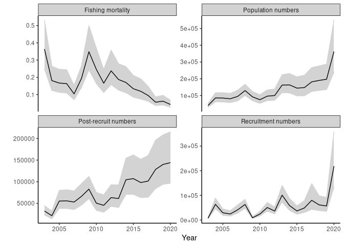

<!-- README.md is generated from README.Rmd. Please edit that file -->

# sbar - Stage-based assessments in R

<!-- badges: start -->
<!-- badges: end -->

sbar is a package that provides functions to allow the user to run
various stage-based fisheries assessments in R. The stage-based
assesments available are versions of the current (2020) Catch-Survey
Analysis (CSA) found in the the NOAA Fish and Fisheries Toolbox and an
implementation of a size-based delay-difference model described in the
throerteical paper by Schnute (1987). Model theory, implementation and
testing are detailed in a manuscript currently under review.

## Installation

This package involves C++ code and the modelling framework of the
package `TMB`. Please ensure that you are able to compile source code
and that this package is running smoothly on your device. Package has
not been tested on the most recent version of R (&gt;=4.0) as of yet

And sbar package can be installed from [GitHub](https://github.com/)
with:

``` r
# install.packages("devtools")
devtools::install_github("lbatts/sbar")
```

## Example

A quick example of running CSA on the black-bellied anglerfish stock.
For a much more detailed look at sbar assessments run
`vignette("sbar")`. Data is structured as
[FLR](https://flr-project.org/) classes and so the appropriate syntax is
required.

``` r
library(sbar)
library(FLCore)
```

``` r
data("ank78")
data("ank78.indices")
years<-as.character(2003:2020) 
no.years<-length(years)
```

Observations needed for a CSA assessment are catch numbers and a matrix
of survey indices (catch numbers per unit effort). A survey split into a
recruit index and post-recruit index (i.e. one survey, two indices) is
the minimum requirement. In this example we use the combined IBTS survey
data that has processed already into number at age. This gives a simple
way to define recruits (age 0) and post-recruits (age 1+).

``` r
catch.no<-c(colSums(catch.n(ank78)[,years]))

no.ind = 2 
IBTS_PR_ages<-as.character(range(ank78.indices$FR_IE_IBTS)["min"]+1:range(ank78.indices$FR_IE_IBTS)["max"])
IBTS_PR_ages
#> [1] "1" "2" "3" "4" "5" "6" "7" "8" "9"

obs<-matrix(NA,nrow=no.ind,ncol=no.years)
obs[1,]<-c(colSums(index(ank78.indices$FR_IE_IBTS)["0",years],na.rm=T)) 
obs[2,]<-c(colSums(index(ank78.indices$FR_IE_IBTS)[IBTS_PR_ages,years],na.rm=T)) 

obs[obs==0]<-NA
```

Many of the settings for running CSA have defaults but the function
requires some user defined values. `indices_att` corresponds to `obs`,
indicating if indices (each row) are from the same survey (i.e. same
number) and what type of indices they are:

1.  recruit index
2.  post-recruit index
3.  undivided index

``` r
att<-data.frame(survey=c(1,1),type=c(1,2))
timing=c(0.875) # survey timing
nm<-mean(m(ank78)) #natural mortality
nm
#> [1] 0.25
```

Lets run the assessment with default settings. There’s warning messages
letting you know that defaults are being used for key inputs.

``` r
obj<- csa(catch_n = catch.no, indices_no = obs, indices_att = att, ts = timing, start_nmort = nm)
#> arg: 'selrec' missing. Recruits survey assumed fully selected
#> arg: 'start_q' missing. Default start q used for each survey
#> arg: 'start_surveycv' missing. Default value used for each survey
#> arg: 'start_catchcv' missing. Default value used for each survey
#> arg: 'start_f_calc' missing. Default value used for each year
#> arg: 'start_rec' missing. Default value used for each year
```

For those familiar with `TMB`, `csa` is simply a wrapper function that
gives the output from `TMB::MakeADFun`. We have kept optimisation and
extraction of values from the assessments separate to allow flexibility
with optimisation methods as well as easy access to TMB outputs such as
the hessian, gradients etc. See documentation for details.

``` r
opt <- nlminb(start=obj$par,objective=obj$fn,gradient=obj$gr)
opt$convergence
#> [1] 0
opt$par
#>    logitqhat     logphat1      logrhat      logrhat      logrhat      logrhat 
#>   -10.000918    10.386337     8.931332    11.060665    10.288809    10.106021 
#>      logrhat      logrhat      logrhat      logrhat      logrhat      logrhat 
#>    10.629008    11.052483     9.120382    10.092034    10.833050    10.498836 
#>      logrhat      logrhat      logrhat      logrhat      logrhat      logrhat 
#>    11.521685    10.979062    10.513877    10.796414    11.288606    11.025207 
#>      logrhat      logrhat    logf_calc    logf_calc    logf_calc    logf_calc 
#>    10.950577    12.293373    -1.011232    -1.710150    -1.791739    -1.810962 
#>    logf_calc    logf_calc    logf_calc    logf_calc    logf_calc    logf_calc 
#>    -2.263982    -1.640474    -1.053673    -1.400797    -1.796318    -1.437401 
#>    logf_calc    logf_calc    logf_calc    logf_calc    logf_calc    logf_calc 
#>    -1.675537    -1.770628    -2.012250    -2.129092    -2.358514    -2.886793 
#>    logf_calc    logf_calc log_surveycv 
#>    -2.783537    -3.159775    -1.693288

obs.srep<-summary(TMB::sdreport(obj))
```

`obs.srep` is a matrix with parameters estimated from optimisation, as
well as standard deviations of those parameters (estimated within TMB
via the delta-method). There is also many other outputs of the
assessment with associated error estimates given here. See function
documentation and vignette for details.

\#Simple plot of assessment results

``` r
survnames<- c("IBTS recruits (CPUE)","IBTS post-recruits (CPUE)")
x<-makesbarclass(obs.srep,survnames,catch.no,obs,years)

plot(x,out="fit")
#> Warning: Removed 2 rows containing missing values (geom_point).
```


``` r
plot(x,out="stock")
```


